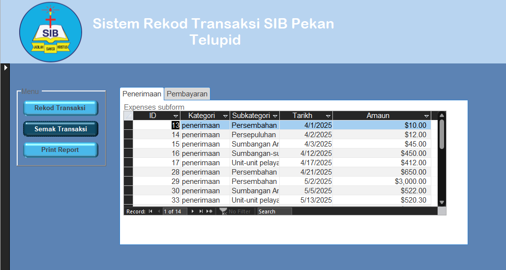

# Expenses Tracker Project

 

The purpose of this project is to create an expenses tracker to track **Penerimaan (Income)** and **Pengeluaran (Expenditure)**.
The project uses Microsoft Access as its DBMS

### Objective
1. **Database creation** which include several tables
2. **UI/UX creation** using form

# Part 1: Database creation

### Tables
4 tables are created for this particular project.

|Expenses|Expense_Dim|Pembayaran_dim|Penerimaan_dim|
|--------|-----------|--------------|--------------|
|To record every income/expenditure made|Dimension table for Expense|Dimension table for Income|Dimension table for Expenditure|

### Entity Relatioship diagram

The entity relationship diagram to show each table's field

# Part 2: UI/UX
In this second part of the project, UI are created using form as medium for data entry
Two SQL query: ```penerimaan``` and ```pembayaran``` and 1 vba code: ```Form_Homepage.cls``` are used in this phase

## Data Cleaning
### 1. Penerimaan
This SQL retrieves expense records from an Expenses table, joining with two other tables — Expense_Dim and penerimaan_dim — to get category and subcategory names. It only shows expenses that belong to category ID = 1.

```
SELECT Expenses.ID, Expense_Dim.Kategori AS kategori_id, penerimaan_dim.subkategori AS subkategori_id, Expenses.tarikh, Expenses.amount
FROM (Expenses INNER JOIN Expense_Dim ON Expenses.kategori_id = Expense_Dim.Expenses_ID) INNER JOIN penerimaan_dim ON Expenses.subkategori_id = penerimaan_dim.ID
WHERE (((Expenses.kategori_id)=1));
```

### 2. Pembayaran
This SQL retrieves expense records from an Expenses table, joining with two other tables — Expense_Dim and pembayaran_dim — to get category and subcategory names. It only shows expenses that belong to category ID = 2.

```
SELECT Expenses.ID, Expense_Dim.Kategori AS kategori_id, pembayaran_dim.subkategori AS subkategori_id, Expenses.tarikh, Expenses.amount
FROM (Expenses INNER JOIN Expense_Dim ON Expenses.kategori_id = Expense_Dim.Expenses_ID) INNER JOIN pembayaran_dim ON Expenses.subkategori_id = pembayaran_dim.ID
WHERE (((Expenses.kategori_id)=2));
```


### 3. Form_Homepage.cls
This VBA code is used for the navigation and form logic. Mainly for UX

1. Loading form
```
Private Sub Form_Load()
    Me.optMenu = 1 ' Default to Button 1
    
    Call optMenu_AfterUpdate
    Me.tahunText.Value = Year(Date)
    Call LoadReportPenerimaan
    Call LoadReportPembayaran
    Call LoadJumlah
End Sub
```
2. Load total expenses into text box
```
Private Sub LoadJumlah()
    Dim jumlah1 As Currency
    Dim jumlah2 As Currency
    Dim jumlah3 As Currency
    
    jumlah1 = Me.jumlahPenerimaanText.Value
    jumlah2 = Me.jumlahPembayaranText.Value
    jumlah3 = jumlah1 - jumlah2
    
    Me.jumlah1.Value = jumlah1
    Me.jumlah2.Value = jumlah2
    Me.jumlah3.Value = jumlah3
End Sub
```
3. Form after update Function
```
Private Sub optMenu_AfterUpdate()
    
    Me.rekodTab.Visible = True
    Me.semakTab.Visible = False
    Me.printTab.Visible = False
    Select Case Me.optMenu.Value
        Case 1
            Me.rekodTab.Visible = True
            Me.semakTab.Visible = False
            Me.printTab.Visible = False
            Call ResetAddForm
        Case 2
            Me.rekodTab.Visible = False
            Me.semakTab.Visible = True
            Me.printTab.Visible = False
            Me.subform1.Form.Requery
            Me.subform2.Form.Requery
        Case 3
            Me.rekodTab.Visible = False
            Me.semakTab.Visible = False
            Me.printTab.Visible = True
            Select Case Me.printTab.Value
                Case 0
                    Call LoadReportPenerimaan
                Case 1
                    Call LoadReportPembayaran
            End Select
            
    End Select
    
End Sub
```
4. Reset form to default state after each operation
```
Private Sub ResetAddForm()
    ' Reset controls for new data entry
    Me.penerimaanCombo = Null        ' Combo box for subkategori
    Me.amaunPenerimaan = Null             ' Text box for amount
    Me.tarikhPenerimaan = Null               ' Set current date as default
    
    Me.pembayaranCombo = Null        ' Combo box for subkategori
    Me.amaunPembayaran = Null             ' Text box for amount
    Me.tarikhPembayaran = Null               ' Set current date as default
End Sub
```

5. Load data into Penerimaan/Pembayaran page (Income/Expenditure). Calculation are also done here
```
Private Sub LoadReportPenerimaan()

    Dim db As DAO.Database
    Dim rs As DAO.Recordset
    Dim totalPersepuluhan As Currency
    Dim totalPersembahan As Currency
    Dim totalSumbanganAnggota As Currency
    Dim totalUnit As Currency
    Dim totalSumbanganKhas As Currency
    Dim totalSumbanganLain As Currency
    Dim totalPenerimaan As Currency
    Dim selectedMonth As Integer
    Dim selectedYear As Integer
    selectedMonth = Me.bulanCombo.Value
    selectedYear = Me.tahunText.Value
    
    Set db = CurrentDb
    
    Set rs = db.OpenRecordset("SELECT Sum(amount) AS total_1 FROM Expenses WHERE kategori_id = 1 AND subkategori_id = 1 AND Month(tarikh) = " & selectedMonth & " AND Year(tarikh) = " & selectedYear)
    If Not rs.EOF Then
        totalPersepuluhan = Nz(rs!total_1, 0)
    End If
    rs.Close
    
    Set rs = db.OpenRecordset("SELECT Sum(amount) AS total_2 FROM Expenses WHERE kategori_id = 1 AND subkategori_id = 2 AND Month(tarikh) = " & selectedMonth & " AND Year(tarikh) = " & selectedYear)
    If Not rs.EOF Then
        totalPersembahan = Nz(rs!total_2, 0)
    End If
    rs.Close
    
    Set rs = db.OpenRecordset("SELECT Sum(amount) AS total_3 FROM Expenses WHERE kategori_id = 1 AND subkategori_id = 3 AND Month(tarikh) = " & selectedMonth & " AND Year(tarikh) = " & selectedYear)
    If Not rs.EOF Then
        totalSumbanganAnggota = Nz(rs!total_3, 0)
    End If
    rs.Close
    
    Set rs = db.OpenRecordset("SELECT Sum(amount) AS total_4 FROM Expenses WHERE kategori_id = 1 AND subkategori_id = 4 AND Month(tarikh) = " & selectedMonth & " AND Year(tarikh) = " & selectedYear)
    If Not rs.EOF Then
        totalSumbanganKhas = Nz(rs!total_4, 0)
    End If
    rs.Close
    
    Set rs = db.OpenRecordset("SELECT Sum(amount) AS total_5 FROM Expenses WHERE kategori_id = 1 AND subkategori_id = 5 AND Month(tarikh) = " & selectedMonth & " AND Year(tarikh) = " & selectedYear)
    If Not rs.EOF Then
        totalSumbanganLain = Nz(rs!total_5, 0)
    End If
    rs.Close
    
    Set rs = db.OpenRecordset("SELECT Sum(amount) AS total_6 FROM Expenses WHERE kategori_id = 1 AND subkategori_id = 6 AND Month(tarikh) = " & selectedMonth & " AND Year(tarikh) = " & selectedYear)
    If Not rs.EOF Then
        totalUnit = Nz(rs!total_6, 0)
    End If
    rs.Close
    
    totalPenerimaan = totalPersepuluhan + totalPersembahan + totalSumbanganAnggota + totalUnit + totalSumbanganKhas + totalSumbanganLain
    
    Me.persepuluhanText.Value = totalPersepuluhan
    Me.persembahanText.Value = totalPersembahan
    Me.sumbanganText.Value = totalSumbanganAnggota
    Me.unitText.Value = totalUnit
    Me.khasText.Value = totalSumbanganKhas
    Me.lainText.Value = totalSumbanganLain
    Me.jumlahPenerimaanText.Value = totalPenerimaan
    Debug.Print "Function started"
End Sub
```
6. Data entry page
```
Private Sub pembayaran_add_Click()

    Dim db As DAO.Database
    Dim subkategori_id As Long
    Dim kategori_id As Long
    Dim tarikh As Date
    Dim amount As Currency
    Dim strSQL As String
    
     On Error GoTo ErrorHandler

    ' Set database object
    Set db = CurrentDb
    
    ' Basic validation
    If IsNull(Me.pembayaranCombo) Or IsNull(Me.amaunPembayaran) Then
        MsgBox "Sila pilih jenis Transaksi Pembayaran dan isi amaun wang", vbExclamation
        Exit Sub
    End If
    
    subkategori_id = Me.pembayaranCombo.Value
    amount = CCur(Me.amaunPembayaran.Value)
    kategori_id = 2
    tarikh = Me.tarikhPembayaran.Value
    
    ' Create SQL statement with kategori hardcoded as 1
    strSQL = "INSERT INTO Expenses (kategori_id, subkategori_id, tarikh, amount) " & _
          "VALUES (2, " & subkategori_id & ", #" & Format(tarikh, "yyyy-mm-dd") & "#, " & amount & ");"

   
    ' Execute SQL
    db.Execute strSQL, dbFailOnError

    MsgBox "Berjaya Direkodkan.", vbInformation

    ' Optional: Clear the form
    Me.pembayaranCombo = Null
    Me.tarikhPembayaran = Null
    Me.amaunPembayaran = Null

    Exit Sub

ErrorHandler:
    MsgBox "Error: " & Err.Description, vbCritical
End Sub
```

# Interface
### Record page

The landing page. This page is for data entry

### Check history

The expense history page. This page display all recorded data

### Print page


Display data for specific month for printing purposes

# Conclusion
There's definitely improvement that can be made in this project. Here is the list of task that need to be done for further improvement

- [x] Create data entry page
- [x] Create history page
- [x] Create printing page
- [ ] Implement delete/edit data
